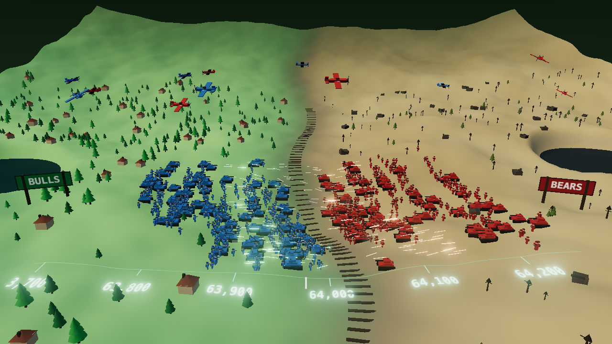

# ⚔️ Bitcoin Battlefield

El order book de Bitcoin en vivo convertido en un campo de batalla 3D: los **toros** (bids)
pelean contra los **osos** (asks) sobre un terreno cuya altura *es* la profundidad real del
libro de órdenes de Binance.



_La escena 3D con datos reales de Binance. El HUD va en DOM sobre el canvas, así que no
sale en esta captura._

---

## Qué estás viendo

Un valle en plena Segunda Guerra Mundial, visto desde una cámara oblicua baja.

| Elemento en pantalla | Qué representa |
| --- | --- |
| **Vía de tren serpenteante** | El precio medio. Es la frontera: divide el valle en dos y todo lo demás se organiza a su alrededor. |
| **Ladera verde y frondosa (izquierda)** | Territorio de los toros: los bids, precios por debajo del mid. |
| **Tierra ocre y seca (derecha)** | Territorio de los osos: los asks, precios por encima. |
| **Soldados y tanques azules / rojos** | Cada tramo de precio es una franja del terreno; el volumen de ese tramo decide cuántas unidades hay plantadas ahí. Una pared de liquidez se ve como una concentración de tropas. |
| **Aviones** | Sobrevuelan la línea del frente, uno por bando. Ambientación, no dato. |
| **Trazadoras y explosiones** | Trades ejecutados. Dispara el bando agresor: azul si la compra barrió el ask, rojo si la venta barrió el bid. El calibre va con el tamaño de la orden. |
| **Desplazamiento del frente** | La presión de mercado mueve la vía, la frontera de color y el avance de las tropas: el bando dominante gana terreno literalmente. |
| **Regla en el suelo** | Niveles de precio absolutos marcados como ticks en la tierra, en el borde inferior. |

El campo cubre una ventana de **±0,25 %** alrededor del precio medio, agrupada en 24 tramos
por bando. Sin esa agrupación no se vería nada: el top del libro de BTCUSDT abarca solo unos
centavos.

## Datos

Todo sale de la **API pública de Binance — sin API key, sin registro**:

- `btcusdt@depth@100ms` — diffs del order book, sincronizados contra un snapshot REST
  (`/api/v3/depth?limit=5000`) siguiendo el algoritmo oficial de libro local, con
  re-sincronización automática si se detecta un hueco en la secuencia.
- `btcusdt@aggTrade` — trades agregados; el flag `m` decide quién fue el agresor.
- `btcusdt@ticker` — estadísticas de 24 h (máximo, mínimo, volumen, variación).

**Fallback:** si Binance no responde (geobloqueo, CORS, red caída, o simplemente estás sin
internet) arranca un feed simulado que mantiene un order book real con paredes que aparecen
y se consumen. La app nunca se queda en negro. El HUD lo indica en ámbar
(`DATOS SIMULADOS`) y sigue reintentando la conexión real cada 25 s; en cuanto Binance
vuelve, corta el simulador y retoma los datos de verdad.

## Cómo ejecutarlo

Requiere Node 18+.

```bash
npm install
npm run dev
```

Abre <http://localhost:5173>.

Para producción:

```bash
npm run build     # genera dist/
npm run preview   # sirve dist/ en local
```

El build usa rutas relativas, así que `dist/` se puede servir desde cualquier hosting
estático (o subcarpeta) sin tocar nada.

## Controles

| Tecla / gesto | Acción |
| --- | --- |
| Arrastrar | Orbitar la cámara |
| Rueda | Zoom |
| `R` | Reencuadrar la cámara |
| `B` | Activar/desactivar bloom (súbelo de FPS si vas justo) |

## Estructura

```
index.html               HUD en DOM + canvas
src/
  main.js                Wiring: feed → escena → HUD, y bucle de render
  style.css              HUD estilo terminal (scanlines, viñeta, esquinas de mira)
  hud.js                 Precio,24h, market pressure, paredes, market feed
  lib/
    emitter.js           Mini event emitter
    orderbook.js         Libro local + agrupación en tramos de precio
  feed/
    index.js             Orquestador live ⇄ simulado con reintentos
    live.js              WebSocket + snapshot REST de Binance
    sim.js               Feed simulado (mismos eventos, mismo OrderBook)
  scene/
    field.js             Constantes del campo y la curva de la vía
    noise.js             Ruido determinista (el valle es idéntico en cada recarga)
    terrain.js           Campo de alturas, malla del valle, lagos, shader de territorios
    models.js            Geometrías low-poly WW2 con color horneado por vértice
    props.js             Vía, árboles, casas, ruinas, carteles y regla de precios
    armies.js            Soldados, tanques, aviones, trazadoras, explosiones y humo
    battlefield.js       Orquestador: cámara, luces, composer, bucle
```

### Cómo está montado

- **Una única fuente de verdad para el suelo.** La altura se calcula en CPU una sola vez y
  se hornea en la geometría; el mismo grid sirve para posar árboles, vías, carteles y cada
  soldado, así que nada flota ni se hunde.
- **Lo único que cambia en vivo es el color.** La frontera verde/árido se resuelve en el
  fragment shader a partir de un uniform, de modo que el territorio cambia de dueño según
  la presión sin recalcular geometría.
- **La vía es la frontera.** La misma curva (`roadOffset` en `field.js`) la usan el shader
  del terreno, la geometría de la vía y la colocación de las tropas. Está duplicada inline
  en el GLSL: si se toca en un sitio, hay que tocarla en el otro.
- **Todo instanciado.** Soldados, tanques, aviones, árboles, casas y trazadoras van en
  `InstancedMesh`; ~1.500 unidades animadas cuestan ~1 ms de CPU por frame.
- **Las plazas son fijas.** Cada tramo tiene sus posiciones sorteadas una vez con semilla:
  cuando el volumen sube y baja, las unidades aparecen y desaparecen en su sitio en vez de
  bailar por el campo.

## Notas

- El precio grande se actualiza con cada trade (instantáneo), no con el ticker de 1 s.
- Los eventos de libro llegan a 10 Hz pero se consumen a ritmo de render.
- La normalización usa un máximo suavizado: cuando entra una pared enorme, el reparto de
  tropas se reajusta progresivamente en lugar de vaciar el resto del campo de golpe.

## Ideas para siguientes iteraciones

- Cámara cinemática que persiga los barridos de liquidez grandes.
- Cráteres persistentes donde han caído las órdenes grandes.
- Sonido reactivo al flujo de órdenes.
- Selector de símbolo (ETH, SOL…) y de ventana de precio.
- Marcar liquidaciones con el stream de futuros (`@forceOrder`).
